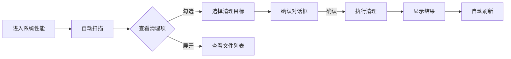

# 🌲 Treeks · 多用户 Markdown 日记平台

> 记录生活中的每一片绿叶 —— 一款采用 Apple 液态玻璃设计风格的多用户 Markdown 日记应用，支持日历日程、主题切换、数据导入导出与平台管理。


---

## ✨ 功能特性

### 📝 日记核心功能
- **Markdown 编辑**：支持 GFM 语法、代码高亮、实时预览
- **三模式切换**：分屏 / 编辑 / 预览，按需切换
- **多媒体内容**：心情、天气、标签、置顶、公开/私密切换
- **图片管理**：上传图片自动归类，支持配额管理
- **智能搜索**：按标题、内容、标签、日期多维筛选


### 📅 日历与日程
- **月历视图**：直观展示每日日记数与日程安排
- **日程管理**：创建、编辑、删除日程，颜色分类
- **日记关联**：点击日期快速查看当日所有日记


### 🎨 主题系统
- **7 套主题**：森林绿（默认）、海洋蓝、薰衣草、暖橙、樱花粉、午夜黑、跟随系统
- **即时切换**：基于 CSS 变量，切换无需刷新
- **用户独立**：每个用户的主题偏好独立保存
- **完整适配**：所有页面（含管理后台与系统清理）在每种主题下均有良好对比度

> 以下所有截图均在默认「森林绿」白色淡绿主题下截取


### 📤 数据导入导出

#### 用户级
- **导出**：JSON（仅元数据）或 ZIP（含图片文件）
- **导入**：从其他平台导出的 JSON 合并到当前账号
- **去重策略**：按 标题+内容+时间 自动去重

#### 管理员级
- **一键导出**：全平台所有用户、日记、图片、日程、设置
- **批量导入**：从平台备份 JSON 恢复数据
- **安全策略**：导入用户时重置密码、不导入管理员权限


### 🛡️ 管理后台

#### 管理概览
- 用户、日记、图片、存储四维统计卡片
- 7 天注册/日记趋势图
- 最活跃用户排行榜（金银铜徽章）


#### 用户管理
- 用户列表（搜索、状态筛选、分页）
- 编辑用户：昵称、状态、管理员权限、存储配额
- 重置密码、删除用户（连带清理上传文件）

#### 平台设置
- 注册开关、站点名称、站点公告
- 默认存储配额配置

#### 操作日志
- 完整记录管理员所有操作（更新设置、用户管理、数据导入导出等）

### 🧹 系统清理（新功能）

系统性能页面新增智能清理功能，可扫描并清理项目运行产生的垃圾文件，**严格保护用户数据不被删除**。


#### 清理项目分类

| 类别 | 说明 | 是否删除文件 |
| --- | --- | --- |
| **根目录垃圾文件** | 测试导出、临时文件、备份、日志、`.DS_Store`、`Thumbs.db` 等 | ✅ 直接删除 |
| **孤儿上传文件** | 文件存在于 `uploads/` 但数据库 `images` 表无记录 | ✅ 直接删除 |
| **空的上传目录** | 用户已删除但目录残留的空文件夹 | ✅ 删除空目录 |
| **数据库 WAL 文件** | SQLite WAL 日志，可通过 checkpoint 合并到主库 | ⚙️ 执行 checkpoint |

#### 安全保障

清理服务在 [services/cleanup.js](services/cleanup.js) 中实现，遵循以下安全原则：

1. **白名单机制**：仅清理匹配 `test-*`、`tmp-*`、`*.tmp`、`*.bak`、`*.log` 等明确模式的文件
2. **数据库反查**：上传文件清理前会查询 `images` 表，仅删除数据库无记录的孤儿文件
3. **用户数据保护**：用户的日记、有效图片、账户信息、平台设置**永远不会被删除**
4. **WAL 安全合并**：数据库 WAL 文件通过 SQLite 官方 `wal_checkpoint(TRUNCATE)` 合并，不直接删除
5. **预览先行**：所有清理操作均可在执行前预览，确认无误后再清理
6. **操作日志**：所有清理操作记录到管理员日志，可追溯

#### 使用流程



#### API 接口

```http
# 预览可清理项
GET /api/admin/system/cleanup/preview
Authorization: Bearer <admin-token>

# 执行清理
POST /api/admin/system/cleanup
Content-Type: application/json
Authorization: Bearer <admin-token>

{
  "targets": ["root-junk", "orphan-uploads", "empty-dirs", "db-wal"]
}
```

---

## 🚀 快速开始

### 环境要求

- Node.js >= 18
- Windows / macOS / Linux

### 安装与运行

```bash
# 克隆仓库
git clone https://github.com/cha3343954211/Treeks.git
cd Treeks

# 安装依赖
npm install

# 启动服务
npm start
# 或开发模式
npm run dev
```

启动后访问 [http://localhost:3000](http://localhost:3000)。

### 默认管理员

首次启动时，系统会自动将最早注册的用户设为管理员。如需手动指定，可通过数据库直接修改 `users` 表的 `is_admin` 字段。

---

## 🏗️ 技术架构

### 技术栈

| 层级 | 技术 |
| --- | --- |
| 后端 | Node.js + Express |
| 数据库 | SQLite (better-sqlite3) + WAL 模式 |
| 前端 | 原生 HTML/CSS/JS + marked + highlight.js |
| 认证 | JWT (7 天有效期) |
| 文件处理 | multer + archiver (ZIP 打包) |
| PDF 导出 | Puppeteer (可选) |

### 项目结构

```
Treeks/
├── data/                      # 数据库文件
│   ├── treeks.db              # SQLite 主库
│   ├── treeks.db-wal          # WAL 日志
│   └── treeks.db-shm          # 共享内存
├── middleware/
│   └── auth.js                # JWT 认证中间件
├── public/                    # 前端静态资源
│   ├── css/style.css          # 主样式（含 7 套主题）
│   ├── js/app.js              # 前端应用逻辑
│   ├── index.html             # 入口页面
│   └── uploads/               # 用户上传文件
├── routes/                    # API 路由
│   ├── auth.js                # 认证（登录/注册/主题）
│   ├── diaries.js             # 日记 CRUD
│   ├── schedules.js           # 日程 CRUD
│   ├── upload.js              # 图片上传
│   ├── export.js              # 用户级导出/导入
│   └── admin.js               # 管理员接口
├── services/                  # 业务服务
│   ├── dataTransfer.js        # 数据迁移（导入/导出）
│   ├── exportService.js       # PDF/HTML 导出
│   └── cleanup.js             # 系统清理服务 ⭐
├── templates/                 # PDF 导出模板
│   ├── default.html
│   ├── elegant.html
│   └── cover.html
├── db.js                      # 数据库初始化
├── server.js                  # 应用入口
└── package.json
```

### 数据库模型

```sql
-- 用户表
users (id, username, password, nickname, avatar, bio,
       is_admin, status, storage_limit, theme, created_at)

-- 日记表
diaries (id, user_id, title, content, mood, weather,
         tags, is_pinned, is_public, created_at, updated_at)

-- 图片表
images (id, user_id, filename, original_name, size, url, created_at)

-- 日程表
schedules (id, user_id, title, description, schedule_date,
           start_time, end_time, color, is_done, created_at, updated_at)

-- 平台设置
settings (key, value, updated_at)

-- 管理员操作日志
admin_logs (id, admin_id, action, target, detail, created_at)
```

---

## 📡 API 文档

### 认证

| 方法 | 路径 | 说明 |
| --- | --- | --- |
| POST | `/api/auth/register` | 注册新用户 |
| POST | `/api/auth/login` | 登录 |
| GET | `/api/auth/me` | 获取当前用户 |
| PUT | `/api/auth/theme` | 切换主题 |
| GET | `/api/auth/site-info` | 获取站点信息 |

### 日记

| 方法 | 路径 | 说明 |
| --- | --- | --- |
| GET | `/api/diaries` | 日记列表（支持分页/筛选） |
| POST | `/api/diaries` | 创建日记 |
| GET | `/api/diaries/:id` | 获取日记详情 |
| PUT | `/api/diaries/:id` | 更新日记 |
| DELETE | `/api/diaries/:id` | 删除日记 |
| POST | `/api/diaries/export` | 批量导出（MD/PDF） |
| GET | `/api/diaries/:id/export.md` | 单篇导出 MD |
| GET | `/api/diaries/:id/export.pdf` | 单篇导出 PDF |

### 数据导入导出（用户级）

| 方法 | 路径 | 说明 |
| --- | --- | --- |
| GET | `/api/diaries/user-data/export` | 导出我的数据 |
| POST | `/api/diaries/user-data/import` | 导入数据 |
| POST | `/api/diaries/user-data/preview` | 导入预览 |

### 管理员

| 方法 | 路径 | 说明 |
| --- | --- | --- |
| GET | `/api/admin/dashboard` | 管理概览统计 |
| GET/PUT | `/api/admin/settings` | 平台设置 |
| GET | `/api/admin/users` | 用户列表 |
| GET/PUT | `/api/admin/users/:id` | 用户详情/更新 |
| POST | `/api/admin/users/:id/reset-password` | 重置密码 |
| DELETE | `/api/admin/users/:id` | 删除用户 |
| GET | `/api/admin/logs` | 操作日志 |
| GET | `/api/admin/system` | 系统性能 |
| GET | `/api/admin/system/cleanup/preview` | ⭐ 清理预览 |
| POST | `/api/admin/system/cleanup` | ⭐ 执行清理 |
| GET | `/api/admin/export/all` | 平台数据导出 |
| GET | `/api/admin/export/preview` | 导出预览 |
| POST | `/api/admin/import` | 平台数据导入 |

---

## 🧹 系统清理详解

### 清理服务设计

清理功能由独立的 [services/cleanup.js](services/cleanup.js) 服务实现，路由层在 [routes/admin.js](routes/admin.js) 中挂载，前端 UI 集成在系统性能页面。

### 清理流程

#### 1. 扫描阶段

```javascript
// services/cleanup.js
function previewCleanup() {
  const rootJunk = scanRootJunk();        // 扫描根目录垃圾文件
  const orphanUploads = scanOrphanUploads(); // 扫描孤儿上传
  const emptyDirs = scanEmptyUploadDirs();   // 扫描空目录
  const dbInfo = getDbInfo();                // 数据库信息
  // 聚合返回
}
```

#### 2. 执行阶段

```javascript
function executeCleanup(targets) {
  // 按选定目标分别清理
  // - root-junk: fs.unlinkSync()
  // - orphan-uploads: fs.unlinkSync() (查 DB 确认无引用)
  // - empty-dirs: fs.rmdirSync()
  // - db-wal: db.pragma('wal_checkpoint(TRUNCATE)')
}
```

### 垃圾文件识别规则

| 模式 | 说明 |
| --- | --- |
| `test-*.{zip,pdf,md,json,txt,html}` | 测试导出产物 |
| `tmp-*.{zip,json,txt,md}` | 临时导出文件 |
| `*.tmp` | 临时文件 |
| `*.bak` | 备份文件 |
| `*.log` | 日志文件 |
| `npm-debug.log*` | npm 调试日志 |
| `.DS_Store` | macOS 系统文件 |
| `Thumbs.db` | Windows 缩略图缓存 |

### 清理效果示例

测试环境中清理前后对比：

```
清理前：
  - 根目录垃圾文件：4 项，625 KB（test-batch.zip, test-export.md, test-export.pdf, test-merged.pdf）
  - 数据库 WAL：1.5 MB
  - 总计可释放：~2.1 MB

清理后：
  - 根目录垃圾文件：0 项
  - 数据库 WAL：12 KB（已 checkpoint 合并）
  - 释放空间：625 KB 文件 + 1.5 MB WAL 数据
```

---

## 🔧 配置

### 环境变量

复制 `.env.example` 为 `.env` 并按需修改：

```bash
# JWT 密钥（生产环境务必修改）
JWT_SECRET=your_secret_here

# JWT 过期时间
JWT_EXPIRES=7d

# 服务端口
PORT=3000
```

### 平台设置（管理员后台）

- **允许注册**：控制新用户注册开关
- **站点名称**：显示在登录页与浏览器标题
- **站点公告**：登录页显示的公告信息
- **默认存储配额**：新用户默认存储上限（字节）

---

## 📦 部署

### 生产环境建议

1. **反向代理**：使用 Nginx 反向代理，启用 HTTPS
2. **进程守护**：使用 PM2 或 systemd 保持服务运行
3. **数据备份**：定期调用管理员导出接口生成 JSON 备份
4. **清理维护**：定期进入系统性能页面执行清理，释放磁盘空间

### PM2 部署示例

```bash
# 安装 PM2
npm install -g pm2

# 启动应用
pm2 start server.js --name treeks

# 设置开机自启
pm2 startup
pm2 save
```

---

## 🤝 贡献指南

1. Fork 本仓库
2. 创建特性分支：`git checkout -b feature/your-feature`
3. 提交更改：`git commit -m 'feat: add your feature'`
4. 推送分支：`git push origin feature/your-feature`
5. 提交 Pull Request

### 提交规范

- `feat:` 新功能
- `fix:` Bug 修复
- `docs:` 文档更新
- `style:` 代码格式
- `refactor:` 重构
- `test:` 测试
- `chore:` 构建/工具

---

## 📄 许可证

MIT License © 2026 Treeks

---

## 🙏 致谢

- [Express](https://expressjs.com/) - Web 框架
- [better-sqlite3](https://github.com/WiseLibs/better-sqlite3) - SQLite 驱动
- [marked](https://marked.js.org/) - Markdown 解析
- [highlight.js](https://highlightjs.org/) - 代码高亮
- [archiver](https://www.archiverjs.com/) - ZIP 打包
- [multer](https://github.com/expressjs/multer) - 文件上传

---

<div align="center">

**🌲 Treeks · 记录生活中的每一片绿叶 🌲**

 Made with ❤️ for diary lovers

</div>
