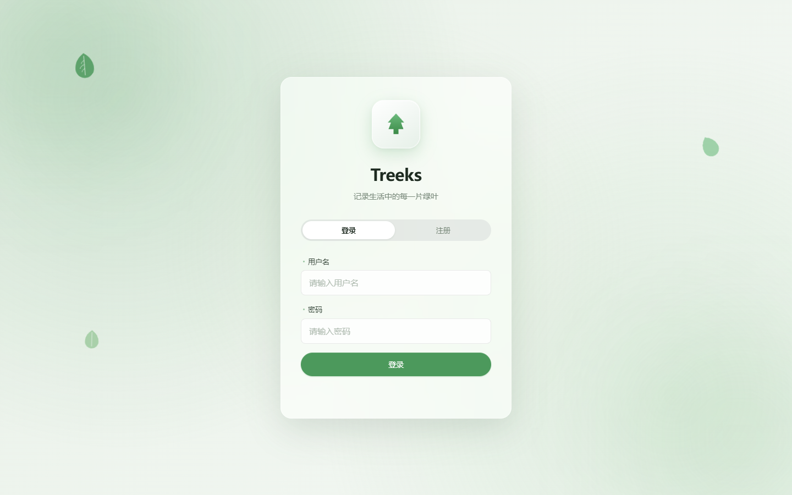
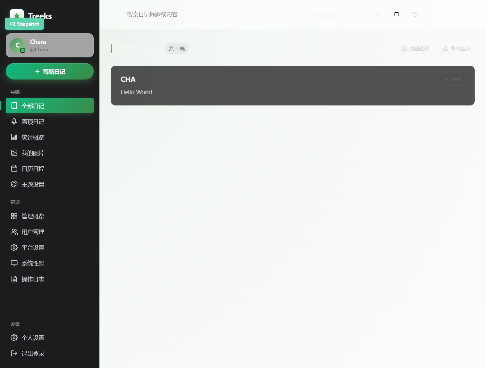
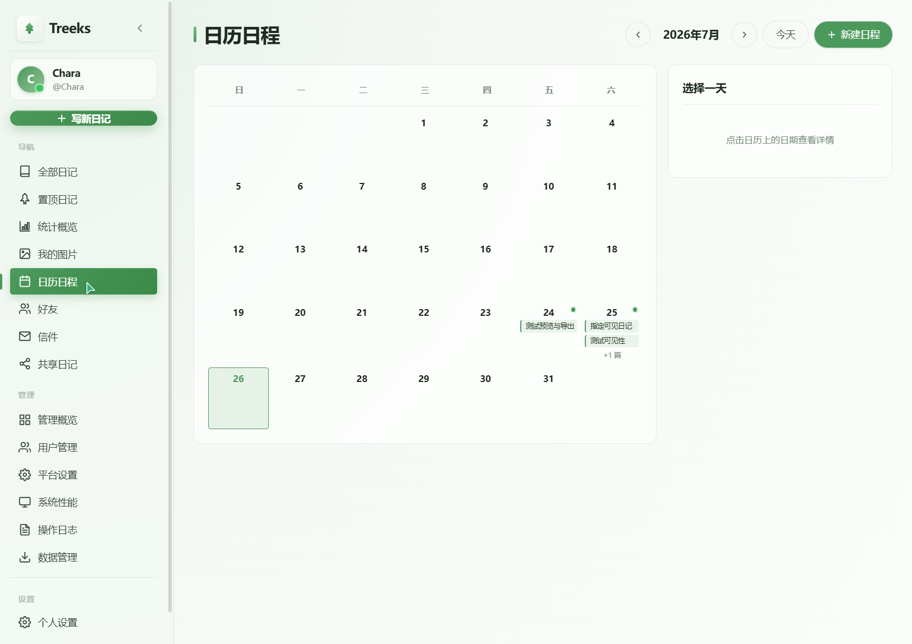
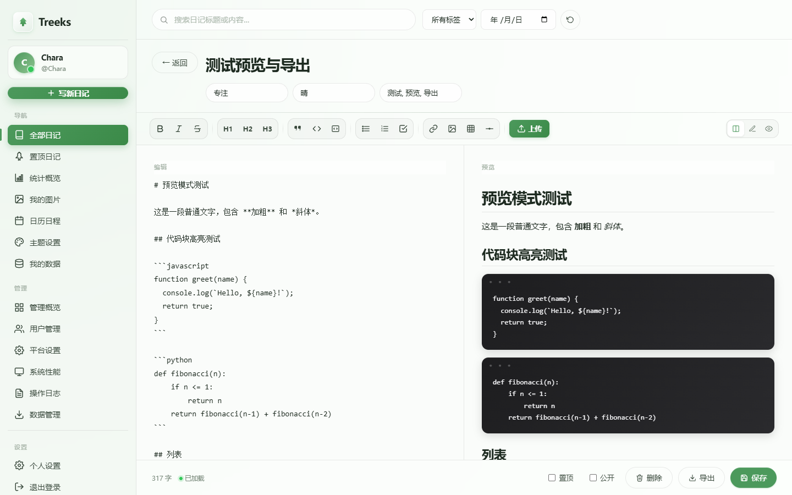
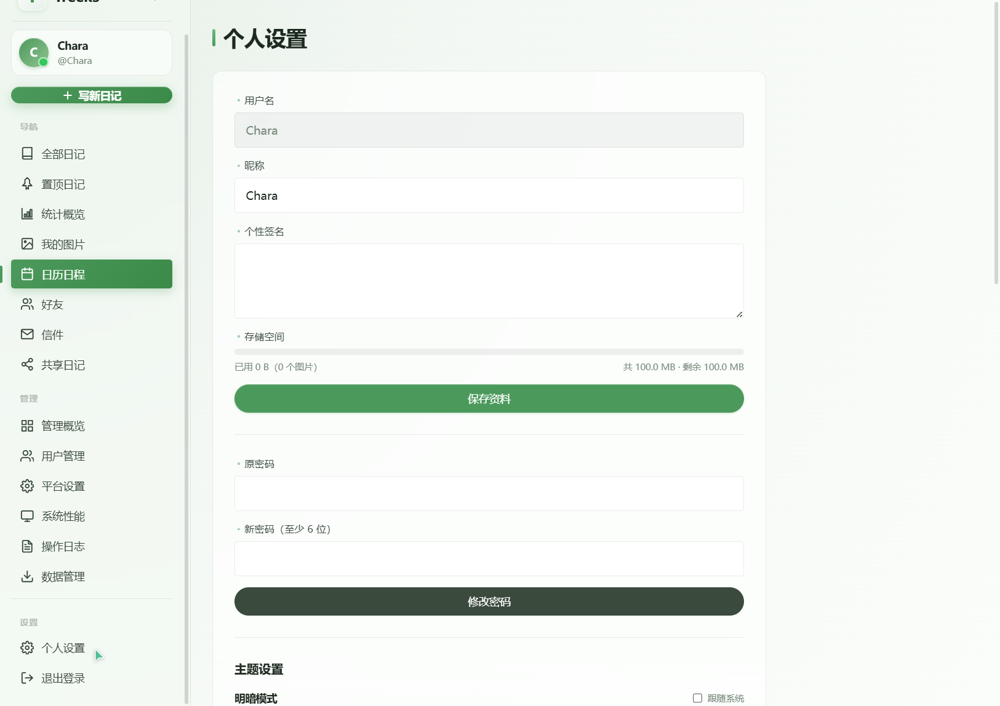
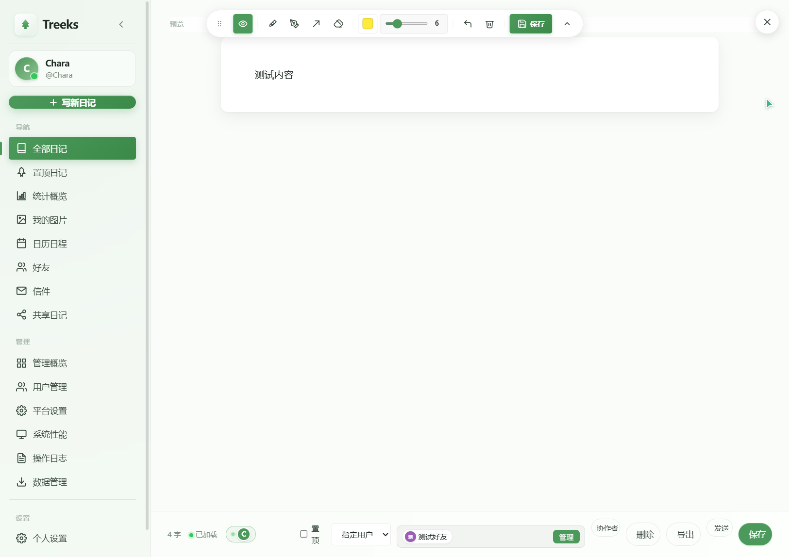
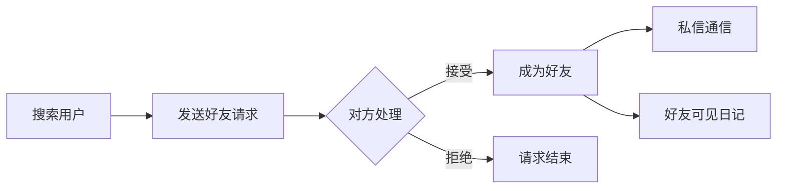
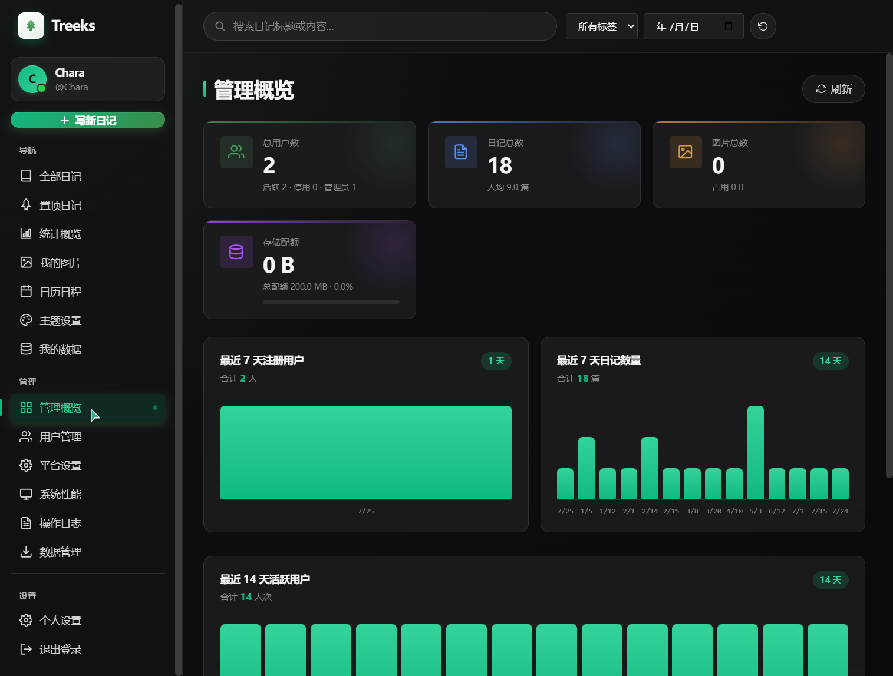
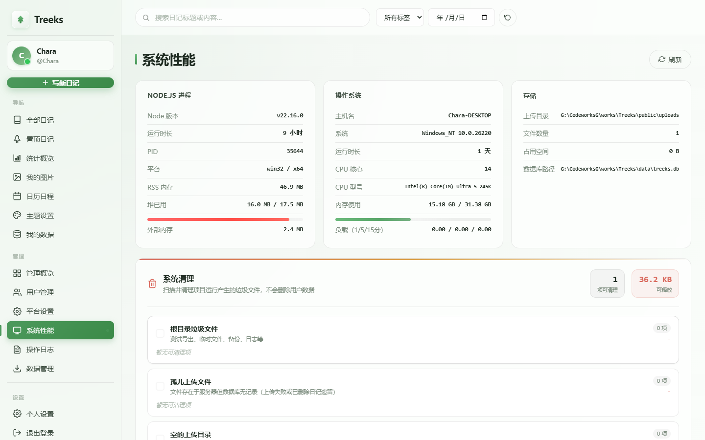
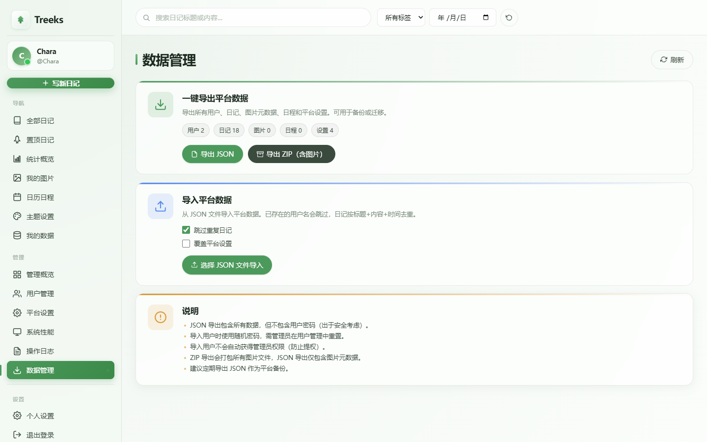

<div align="center">

# 🌲 Treeks · 多用户 Markdown 日记平台

**记录生活中的每一片绿叶**

一款采用 Apple 液态玻璃设计风格的多用户 Markdown 日记应用，支持协同编辑、好友信件、笔刷标注、日历日程、LaTeX 公式、多主题切换与平台管理。

   



</div>

---

## 📖 目录

- [✨ 功能特性](#-功能特性)
- [🚀 快速开始](#-快速开始)
- [🎨 主题系统](#-主题系统)
- [📝 笔刷标注](#-笔刷标注)
- [🤝 社交功能](#-社交功能)
- [🛡️ 管理后台](#️-管理后台)
- [🏗️ 技术架构](#️-技术架构)
- [📡 API 文档](#-api-文档)
- [📦 部署](#-部署)
- [🤝 贡献指南](#-贡献指南)

---

## ✨ 功能特性

### 📝 日记核心

| 功能 | 说明 |
| --- | --- |
| **Markdown 编辑** | 支持 GFM 语法、代码高亮、LaTeX 公式（KaTeX）、实时预览 |
| **三模式切换** | 分屏 / 编辑 / 全屏预览，一键切换 |
| **多媒体元数据** | 心情、天气、标签、置顶、4 级可见性控制 |
| **语音备忘** | 一键录音并插入日记，预览内直接播放 |
| **Mermaid 图表** | 代码块渲染流程图 / 时序图 / 甘特图 |
| **图片管理** | 上传图片自动归类，配额管理，粘贴即传 |
| **智能搜索** | FTS5 全文检索（英文）+ 子串匹配（中文），支持标题、内容、标签、日期多维筛选 |
| **写作热力图** | GitHub 风格 365 天写作统计，含连续天数 |
| **PDF / HTML 导出** | 3 套排版模板，支持单篇与批量导出 |

### 📱 PWA 与离线
- **安装到桌面/手机**：支持 `manifest.json` + 应用图标，一键添加到主屏幕
- **离线可用**：Service Worker 缓存应用外壳，断网时仍可浏览已缓存页面，联网自动恢复
- **自动压缩**：图片上传前自动降采样压缩，节省存储与流量
- **日程提醒**：日程开始前 15 分钟系统通知提醒



### 📅 日历与日程

- **月历视图**：直观展示每日日记数与日程安排
- **日程管理**：创建、编辑、删除日程，颜色分类
- **日记关联**：点击日期快速查看当日所有日记



### 🔄 协同编辑

基于 WebSocket 的实时协同编辑，多人同时编辑同一篇日记：

- **实时同步**：标题、内容变更即时广播给所有协作者
- **在线状态**：显示当前正在编辑的协作者列表
- **权限分级**：拥有者 / 编辑者 / 查看者三种角色
- **光标同步**：协作者光标位置实时显示



### 📨 好友与信件

- **好友系统**：搜索用户、发送请求、双向确认
- **私信信件**：仅限好友间发送，可附带日记分享
- **已读回执**：收件人查看时自动标记已读时间
- **未读提醒**：侧边栏徽标实时显示未读数

---

## 🚀 快速开始

### 环境要求

- Node.js >= 18
- Windows / macOS / Linux

### 安装与运行

```bash
# 克隆仓库
git clone https://github.com/cha3343954211/Treeks.git
cd Treeks

# 安装依赖
npm install

# 启动服务
npm start
# 或开发模式（热重载）
npm run dev
```

启动后访问 [http://localhost:3000](http://localhost:3000)。

### 默认管理员

首次启动时，系统会自动将最早注册的用户设为管理员。如需手动指定，可通过数据库直接修改 `users` 表的 `is_admin` 字段。

---

## 🎨 主题系统

采用 **调色板 + 明暗模式** 双属性方案，8 套调色板 × 2 种明暗 = 16 种组合，每个调色板在明暗模式下均有独立优化的背景渐变与对比度。

| 调色板 | 浅色主色 | 暗色主色 | 风格 |
| --- | --- | --- | --- |
| 🌿 森林绿 `green` | `#4c995c` | `#10b981` | 清新自然（默认） |
| 🌊 海洋蓝 `blue` | `#3b82f6` | `#3b82f6` | 宁静深邃 |
| 💜 薰衣草 `purple` | `#8b5cf6` | `#a78bfa` | 优雅浪漫 |
| 🌅 暖阳橙 `orange` | `#f59e0b` | `#fbbf24` | 温暖活力 |
| 🌸 樱花粉 `pink` | `#ec4899` | `#f472b6` | 柔和甜美 |
| 🌹 玫瑰红 `rose` | `#f43f5e` | `#fb7185` | 热情鲜活 |
| 💎 青碧 `teal` | `#14b8a6` | `#2dd4bf` | 沉静如海 |
| 🔮 靛蓝 `indigo` | `#6366f1` | `#818cf8` | 稳重神秘 |

- **即时切换**：基于 CSS 变量，切换无需刷新
- **跟随系统**：支持 `prefers-color-scheme` 自动适配
- **用户独立**：每个用户的主题偏好独立保存
- **全页面适配**：所有页面（含管理后台）在每种主题下均有良好对比度



---

## 📝 笔刷标注

全屏预览模式下的 GoodNotes 风格笔刷标注工具，支持在日记预览内容上自由绘制：

| 工具 | 说明 |
| --- | --- |
| 🖊️ **钢笔** | 实线标注，可调粗细与颜色 |
| 🖌️ **荧光笔** | 半透明高亮，覆盖文字仍可阅读 |
| ➡️ **讲解笔** | 带箭头的指引线 |
| 🧹 **橡皮** | 点击删除单条标记 |
| ↩️ **撤销** | 撤销上一步绘制 |
| 🗑️ **清除** | 清除全部标记 |
| 💾 **保存** | 标记持久化到本地存储 |

**交互特性**：

- 工具栏 `fixed` 浮动贴视口，**不随页面滚动**
- 可拖拽到屏幕任意位置，拖动后**不回弹**
- 8 色预设色盘 + 自定义取色器
- 笔刷粗细滑块（1-24px）
- 全屏预览退出按钮（右上角 ✕）
- 移动端触摸优化，44px 触摸目标



---

## 🤝 社交功能

### 好友系统



- **双向好友关系**：互加后双方好友列表同步
- **智能合并**：若双方互发请求，自动互加好友
- **好友可见日记**：`friends` 可见性级别，仅好友可读

### 信件功能

- 仅限好友间发送，可附带日记分享
- 收件箱 / 发件箱分离管理
- 收件人查看时自动标记已读

### 日记可见性

| 级别 | 说明 | 可见范围 |
| --- | --- | --- |
| 🔒 `private` | 私有（默认） | 仅自己 + 协作者 |
| 👥 `friends` | 好友可见 | 自己 + 协作者 + 好友 |
| 🎯 `specific` | 指定用户 | 自己 + 协作者 + 指定用户列表 |
| 🌍 `public` | 完全公开 | 所有登录用户 |

---

## 🛡️ 管理后台

### 管理概览

- 用户、日记、图片、存储四维统计卡片
- 7 天注册/日记趋势图
- 最活跃用户排行榜（金银铜徽章）



### 用户管理

- 用户列表（搜索、状态筛选、分页）
- 编辑用户：昵称、状态、管理员权限、存储配额
- 重置密码、删除用户（连带清理上传文件）

### 平台设置

- 注册开关、站点名称、站点公告
- 默认存储配额配置
- **存储位置管理**：支持将数据库与上传文件迁移到自定义路径

### 数据存储位置

管理员可在后台选择数据存储位置，支持将数据库和上传文件迁移到任意可写路径：

- **路径校验**：禁止选择项目根目录或父目录
- **安全迁移**：采用复制而非移动，原数据保留
- **盘符探测**：自动列出可用磁盘（Windows C-H / Unix 挂载点）
- **一键重置**：可随时恢复默认存储位置

### 系统清理

智能清理功能，可扫描并清理垃圾文件，**严格保护用户数据**：

| 类别 | 说明 | 操作 |
| --- | --- | --- |
| 根目录垃圾文件 | 测试导出、临时文件、备份、日志 | 直接删除 |
| 孤儿上传文件 | uploads/ 中存在但数据库无记录 | 直接删除 |
| 空的上传目录 | 用户已删除但目录残留 | 删除空目录 |
| 数据库 WAL 文件 | SQLite WAL 日志 | checkpoint 合并 |



### 数据导入导出

#### 用户级
- **导出**：JSON（仅元数据）或 ZIP（含图片文件）
- **导入**：从导出的 JSON 合并到当前账号
- **去重策略**：按 标题+内容+时间 自动去重

#### 管理员级
- **一键导出**：全平台所有用户、日记、图片、日程、设置
- **批量导入**：从平台备份 JSON 恢复数据
- **安全策略**：导入用户时重置密码、不导入管理员权限



---

## 🏗️ 技术架构

### 技术栈

| 层级 | 技术 |
| --- | --- |
| 后端 | Node.js + Express |
| 数据库 | SQLite (better-sqlite3) + WAL 模式 |
| 实时通信 | WebSocket (ws) — 协同编辑 |
| 前端 | 原生 HTML/CSS/JS + marked + KaTeX + highlight.js |
| 认证 | JWT (7 天有效期) |
| 文件处理 | multer + archiver (ZIP 打包) |
| PDF 导出 | Puppeteer (无头 Chromium) |
| 公式渲染 | KaTeX（前端 CDN + 后端按需加载） |

### 项目结构

```
Treeks/
├── data/                       # 数据库文件（运行时路径可配置）
│   ├── treeks.db               # SQLite 主库
│   ├── treeks.db-wal           # WAL 日志
│   └── treeks.db-shm           # 共享内存
├── middleware/
│   ├── auth.js                 # JWT 认证中间件
│   └── timezone.js             # UTC 时区统一处理
├── public/                     # 前端静态资源
│   ├── css/style.css           # 主样式（8 调色板 × 明暗模式）
│   ├── js/app.js               # 前端应用逻辑
│   ├── index.html              # 入口页面
│   └── uploads/                # 用户上传文件（运行时路径可配置）
├── routes/                     # API 路由
│   ├── auth.js                 # 认证（登录/注册/主题）
│   ├── diaries.js              # 日记 CRUD + 可见性 + 协作者
│   ├── schedules.js            # 日程 CRUD
│   ├── upload.js               # 图片上传
│   ├── export.js               # 导出/导入（MD/PDF/HTML/JSON/ZIP）
│   ├── friends.js              # 好友系统
│   ├── letters.js              # 信件功能
│   └── admin.js                # 管理员接口
├── services/                   # 业务服务
│   ├── collab.js               # WebSocket 协同编辑 ⭐
│   ├── cleanup.js              # 系统清理服务
│   ├── storageLocation.js      # 存储位置管理 ⭐
│   ├── dataTransfer.js         # 数据迁移（导入/导出）
│   └── exportService.js        # PDF/HTML 导出 + 模板引擎
├── templates/                  # PDF 导出模板
│   ├── default.html            # 经典绿意
│   ├── elegant.html            # 优雅排版（衬线字体）
│   ├── cover.html              # 封面卡片
│   └── templates.json          # 模板配置
├── db.js                       # 数据库初始化
├── server.js                   # 应用入口
└── package.json
```

### 数据库模型

```sql
-- 用户表
users (id, username, password, nickname, avatar, bio,
       is_admin, status, storage_limit, theme, created_at)

-- 日记表
diaries (id, user_id, title, content, mood, weather,
         tags, is_pinned, is_public, visibility, created_at, updated_at)

-- 日记可见性（指定用户）
diary_visible_to (diary_id, user_id)

-- 日记协作者
diary_collaborators (diary_id, user_id, role, created_at)

-- 图片表
images (id, user_id, filename, original_name, size, url, created_at)

-- 日程表
schedules (id, user_id, title, description, schedule_date,
           start_time, end_time, color, is_done, created_at, updated_at)

-- 好友关系
friends (user_id, friend_id, created_at)

-- 好友请求
friend_requests (id, from_user_id, to_user_id, message, status, created_at)

-- 信件
letters (id, sender_id, recipient_id, subject, content,
         diary_id, is_read, read_at, created_at)

-- 平台设置
settings (key, value, updated_at)

-- 管理员操作日志
admin_logs (id, admin_id, action, target, detail, created_at)
```

---

## 📡 API 文档

### 认证

| 方法 | 路径 | 说明 |
| --- | --- | --- |
| POST | `/api/auth/register` | 注册新用户 |
| POST | `/api/auth/login` | 登录 |
| GET | `/api/auth/me` | 获取当前用户 |
| PUT | `/api/auth/theme` | 切换主题 |
| GET | `/api/auth/site-info` | 获取站点信息 |

### 日记

| 方法 | 路径 | 说明 |
| --- | --- | --- |
| GET | `/api/diaries` | 日记列表（分页/筛选/排序） |
| POST | `/api/diaries` | 创建日记（含可见性/协作者） |
| GET | `/api/diaries/:id` | 日记详情 |
| PUT | `/api/diaries/:id` | 更新日记 |
| DELETE | `/api/diaries/:id` | 删除日记 |
| PATCH | `/api/diaries/:id/pin` | 置顶/取消置顶 |
| GET | `/api/diaries/shared/list` | 他人可见日记 |
| GET | `/api/diaries/collaborating/list` | 我协作的日记 |
| GET | `/api/diaries/stats/heatmap` | 写作热力图 |
| GET | `/api/diaries/stats/summary` | 统计摘要 |

### 协作者

| 方法 | 路径 | 说明 |
| --- | --- | --- |
| GET | `/api/diaries/:id/collaborators` | 协作者列表 |
| POST | `/api/diaries/:id/collaborators` | 添加协作者 |
| DELETE | `/api/diaries/:id/collaborators/:userId` | 移除协作者 |

### 好友

| 方法 | 路径 | 说明 |
| --- | --- | --- |
| GET | `/api/friends/search` | 搜索用户 |
| POST | `/api/friends/requests` | 发送好友请求 |
| GET | `/api/friends/requests` | 收到的好友请求 |
| GET | `/api/friends/requests/sent` | 发出的好友请求 |
| POST | `/api/friends/requests/:id/accept` | 接受请求 |
| POST | `/api/friends/requests/:id/reject` | 拒绝请求 |
| GET | `/api/friends/` | 好友列表 |
| DELETE | `/api/friends/:friendId` | 删除好友 |
| GET | `/api/friends/summary` | 好友数 + 待处理数 |

### 信件

| 方法 | 路径 | 说明 |
| --- | --- | --- |
| POST | `/api/letters/` | 发送信件（可附带日记） |
| GET | `/api/letters/inbox` | 收件箱 |
| GET | `/api/letters/sent` | 发件箱 |
| GET | `/api/letters/:id` | 查看信件（自动标记已读） |
| DELETE | `/api/letters/:id` | 删除信件 |
| GET | `/api/letters/unread/count` | 未读数 |

### 导出与导入

| 方法 | 路径 | 说明 |
| --- | --- | --- |
| GET | `/api/diaries/templates` | PDF 模板列表 |
| GET | `/api/diaries/:id/export.md` | 单篇导出 MD |
| GET | `/api/diaries/:id/export.pdf` | 单篇导出 PDF |
| GET | `/api/diaries/:id/export.html` | 单篇导出 HTML |
| POST | `/api/diaries/export` | 批量导出（MD/PDF/合并PDF） |
| GET | `/api/diaries/user-data/export` | 用户数据导出（JSON/ZIP） |
| POST | `/api/diaries/user-data/import` | 导入用户数据 |
| POST | `/api/diaries/user-data/preview` | 导入预览 |

### 日程

| 方法 | 路径 | 说明 |
| --- | --- | --- |
| GET | `/api/schedules` | 日程列表 |
| POST | `/api/schedules` | 创建日程 |
| PUT | `/api/schedules/:id` | 更新日程 |
| DELETE | `/api/schedules/:id` | 删除日程 |

### 管理员

| 方法 | 路径 | 说明 |
| --- | --- | --- |
| GET | `/api/admin/dashboard` | 管理概览统计 |
| GET/PUT | `/api/admin/settings` | 平台设置 |
| GET | `/api/admin/users` | 用户列表 |
| GET/PUT | `/api/admin/users/:id` | 用户详情/更新 |
| POST | `/api/admin/users/:id/reset-password` | 重置密码 |
| DELETE | `/api/admin/users/:id` | 删除用户 |
| GET | `/api/admin/logs` | 操作日志 |
| GET | `/api/admin/system` | 系统性能 |
| GET | `/api/admin/system/cleanup/preview` | 清理预览 |
| POST | `/api/admin/system/cleanup` | 执行清理 |
| GET | `/api/admin/storage-location` | 存储位置信息 |
| POST | `/api/admin/storage-location/validate` | 校验目标路径 |
| POST | `/api/admin/storage-location/switch` | 切换存储位置 |
| POST | `/api/admin/storage-location/reset` | 重置为默认 |
| GET | `/api/admin/export/all` | 平台数据导出 |
| POST | `/api/admin/import` | 平台数据导入 |

### WebSocket 协同编辑

连接路径：`ws://host/collab?token=<JWT>`

| 方向 | 消息类型 | 说明 |
| --- | --- | --- |
| → | `join` | 加入日记编辑房间 |
| → | `leave` | 离开房间 |
| → | `edit` | 编辑同步（title/content） |
| → | `cursor` | 光标位置 |
| ← | `presence` | 在线协作者列表 |
| ← | `update` | 编辑内容广播 |
| ← | `cursor` | 光标位置广播 |

---

## 📦 部署

### 生产环境建议

1. **反向代理**：使用 Nginx 反向代理，启用 HTTPS
2. **进程守护**：使用 PM2 或 systemd 保持服务运行
3. **数据备份**：定期调用管理员导出接口生成 JSON 备份
4. **清理维护**：定期进入系统性能页面执行清理
5. **存储规划**：通过管理后台配置独立存储路径

### PM2 部署示例

```bash
# 安装 PM2
npm install -g pm2

# 启动应用
pm2 start server.js --name treeks

# 设置开机自启
pm2 startup
pm2 save
```

### 环境变量

复制 `.env.example` 为 `.env` 并按需修改：

```bash
# JWT 密钥（生产环境务必修改）
JWT_SECRET=your_secret_here

# JWT 过期时间
JWT_EXPIRES=7d

# 服务端口
PORT=3000
```

---

## 🤝 贡献指南

1. Fork 本仓库
2. 创建特性分支：`git checkout -b feature/your-feature`
3. 提交更改：`git commit -m 'feat: add your feature'`
4. 推送分支：`git push origin feature/your-feature`
5. 提交 Pull Request

### 提交规范

| 前缀 | 说明 |
| --- | --- |
| `feat:` | 新功能 |
| `fix:` | Bug 修复 |
| `docs:` | 文档更新 |
| `style:` | 代码格式 |
| `refactor:` | 重构 |
| `test:` | 测试 |
| `chore:` | 构建/工具 |

---

## 📄 许可证

MIT License © 2026 Treeks

---

## 🙏 致谢

- [Express](https://expressjs.com/) — Web 框架
- [better-sqlite3](https://github.com/WiseLibs/better-sqlite3) — SQLite 驱动
- [ws](https://github.com/websockets/ws) — WebSocket 库
- [marked](https://marked.js.org/) — Markdown 解析
- [KaTeX](https://katex.org/) — LaTeX 公式渲染
- [highlight.js](https://highlightjs.org/) — 代码高亮
- [Puppeteer](https://pptr.dev/) — PDF 导出
- [archiver](https://www.archiverjs.com/) — ZIP 打包
- [multer](https://github.com/expressjs/multer) — 文件上传
- [DOMPurify](https://github.com/cure53/DOMPurify) — XSS 防护

---

<div align="center">

**🌲 Treeks · 记录生活中的每一片绿叶 🌲**

Made with ❤️ for diary lovers

</div>
